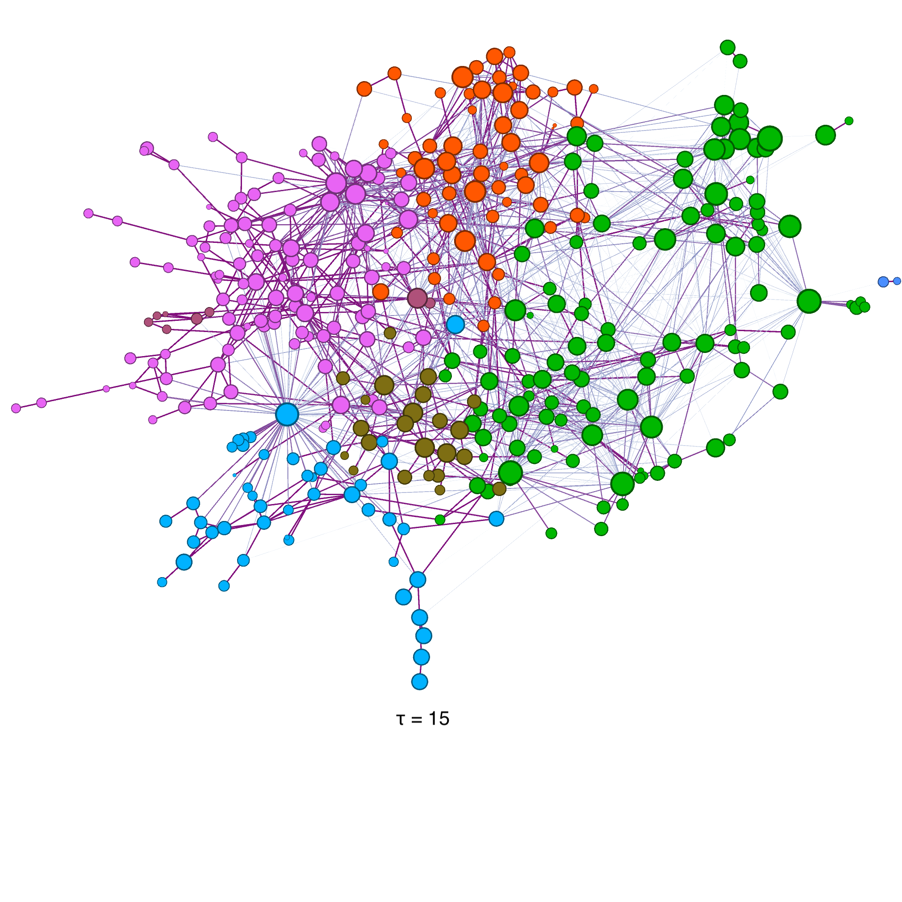

# Annex
\label{Annex}

## Skill-relatedness networks using the "connection" algorithm

The skill-relatedness matrices are used  to construct an undirected weighted network. This network can now be used 
to identify industry clusters.

In this section annex the skill-relatedness networks built using the **connection** algorithm for the periods of 1997-2008 and 
 2009-2018 are discussed. 

### Network descriptors 

Table X. Top five nodes for the network of the period from 1997 to 2008 using the **connection** algorithm in different
degrees and centrality metrics.

|Degree |	Weighted Degree	| Centrality |	Betweeness |
|-------|-------------------|------------|-------------|
|Labour recruitment and provision of personnel	|Management activities of other non-financial holding companies	| Labour recruitment and provision of personnel |Labour recruitment and provision of personnel|
|Management activities of other non-financial holding companies |	Manufacture of other plastic products |Management activities of other non-financial holding companies|	Management activities of other non-financial holding companies  |
|Other business activities not elsewhere classified|Wholesale of photographic goods|Other business activities not elsewhere classified|	Freight transport by road n.e.c.|
|Retail sale |	Manufacture of electronic instruments and appliances for measuring, checking, testing, navigating and other purposes, except industrial process control equipment|Business and management consultancy activities, n.e.c.|Business and management consultancy activities, n.e.c.|
|Freight transport by road n.e.c.|	Retail Sale	|Other software consultancy and supply|Other business activities not elsewhere classified |
|-------|-------------------|------------|-------------|

Table X. Top five nodes for the network of the period from 2009 to 2018 using the **connections** algorithm in different
degrees and centrality metrics.

|Degree |	Weighted Degree	| Centrality |	Betweeness |
|-------|-------------------|------------|-------------|
|Temporary employment agencies|	Temporary employment agencies|	Temporary employment agencies|	Temporary employment agencies|
|Food, beverages, tobacco mainly|	Business, other management|	Office admin, business support|	Primary|
|Beverage serving|	Engineering/tech consultancy|	Beverage serving	Food, beverages, tobacco| mainly|
|Restaurants, mobile food service|	Office admin, business support|	Food, beverages, tobacco mainly|	Office admin, business support|
|Office admin, business support|	Head office activities|	Restaurants, mobile food service|	Engineering/tech consultancy|
|-------|-------------------|------------|-------------|

[Network20092018_conn]: figures/network_2009_2018_conns.png
![Visualisation of the skill-relatedness network for the United Kingdom using the **connection** algorithm in the period from
2009 to 2018. Each node represents a 4-digit industry and each edge the skill-relatedness between the corresponding industry pair. Nodes are sized by the total
employment size in the United Kingdom during 2015 and coloured according to their industry cluster detected according to the Markov
Stability Algorithm (t=1). Only positive edges are shown. The node layout is based on a spring
algorithm called ‘Force Atlas’ in Gephi. \label{Network20092018}][Network20092018_conn]

[Network19972008_conn]: figures/network_1997_2008_conns.png
![Visualisation of the skill-relatedness network for the United Kingdom using the **connection** algorithm n the period from 1997
to 2008. Each node represents a 4-digit industry and each edge the skill-relatedness between the corresponding industry pair. Nodes are sized by the total
employment size in the United Kingdom during 2015 and coloured according to their industry cluster detected according to the Louvain algorithm implemented
in Gephi. Only positive edges are shown. The node layout is based on a spring
algorithm called ‘Force Atlas’ in Gephi. \label{Network19972008}][Network19972008_conn]
        

## Community detection for the 2009 - 2018 period

    - Method description (figures from Mattie)
    
    
[MarkovTimeconnection]: figures/MarkovTimeFigureFlows2009_2018_conns.jpg
![A graph showing the number of communities and the variation of information of the node partition generated
by the Markov Stability Algorithm at different Markov times. This is shown for both the skill-relatedness network (blue) and a
shuffled edge version of this network (orange). \label{MarkovTimeconnection}][MarkovTimeconnection]

{width=50%}
{width=50%}
{width=50%}
{width=50%}
\begin{figure}[!h]
\caption{Visualisation of the skill-relatedness network for the United Kingdom using the **connection** algorithm in the period from
2009 to 2018. The communities are coloured according to their industry cluster detected according to the Markov
Stability Algorithm which is estimated at different resolutions (t=1, 4, 25 and 50).  Each node represents a 4-digit industry and each 
edge the skill-relatedness between the corresponding industry pair. Nodes are sized by the total
employment size in the United Kingdom during 2015. Only positive edges are shown. The node layout is based on a spring
algorithm called ‘Force Atlas’ in Gephi.}
\label{CommunityEvolution_conn}
\end{figure}

    