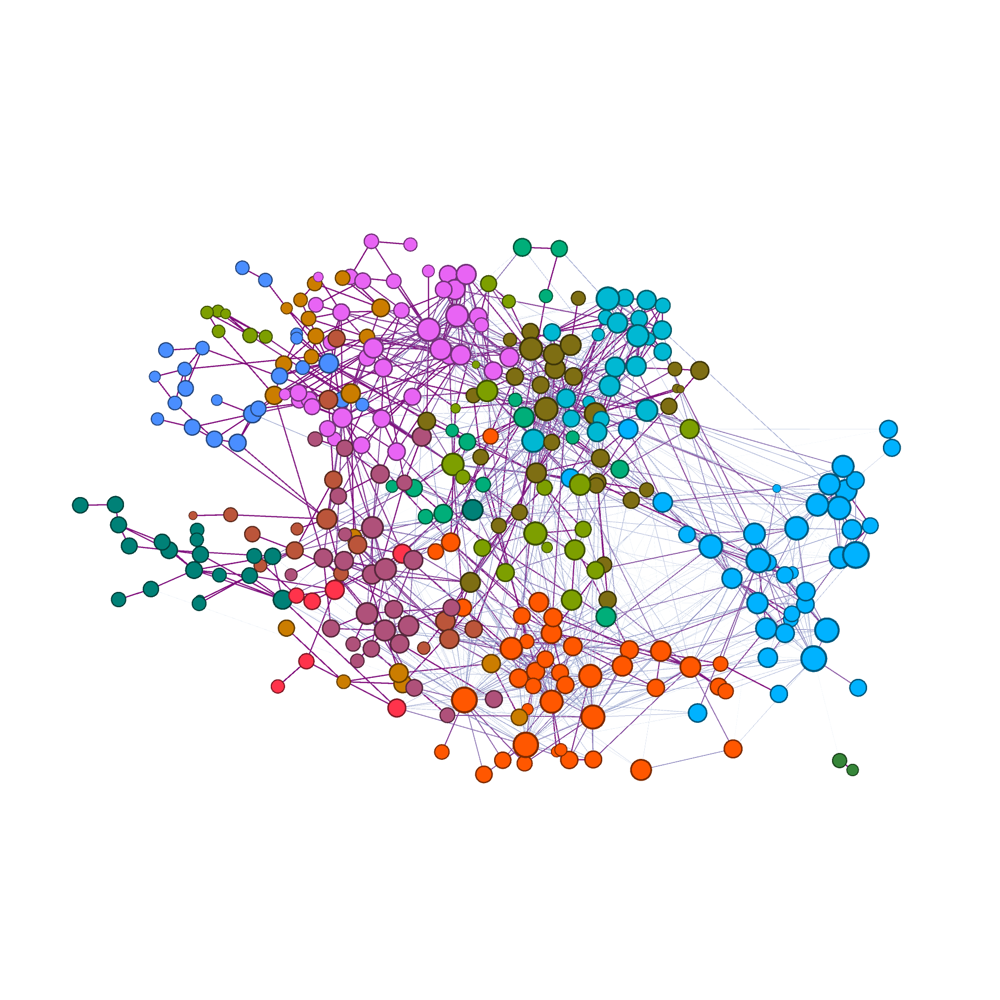
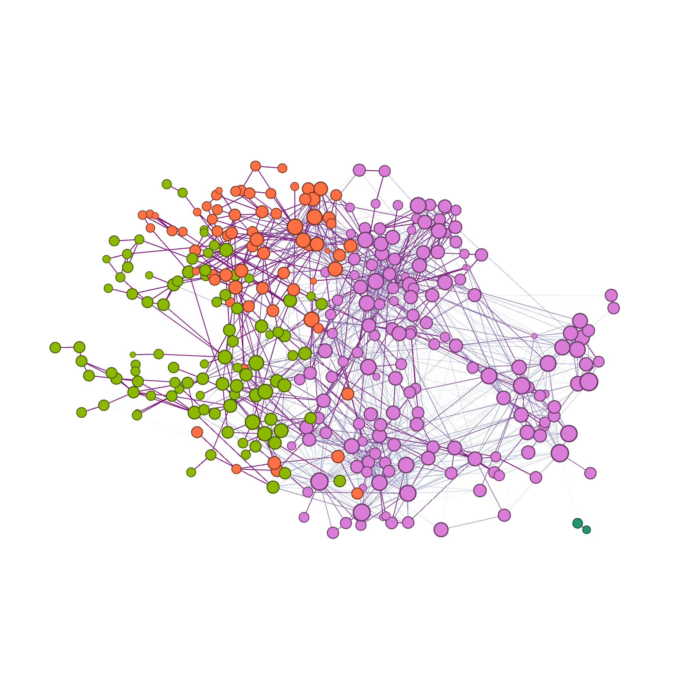
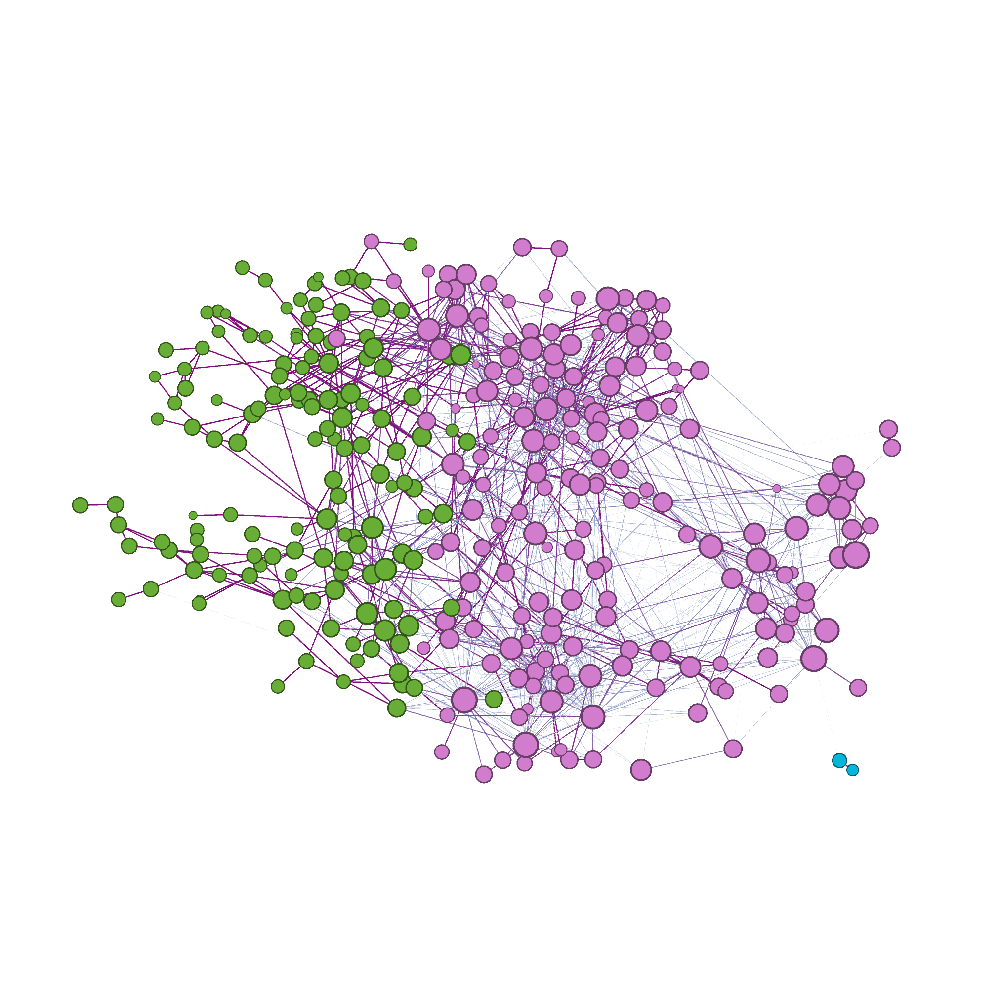

# Annex
\label{Annex}

# Alternative method
 \label{flows}
 
Two approaches can be followed to measure the jobs transition. In the report, the main method of **connections**
is explained. There is an alternative method for estimating the transitions named the **flows** method, which is described next.
 
## Transitions as "flows" 

For a particular *job table* belonging to an individual, the table is sorted by time (the *Year* variable) and a **flow** is 
defined as any two consecutive job entries that comply with the following rules:

   * A valid **flow** can not be separated by more than 2 years.
   * A **flow** can not happen within the same job in 2 different years.

For Table 1, the resulting **flows** would be the following:

| Id    | Flow | Year   Difference  |Work  Postcodes   |
|-------|------|----------|---------|
| 1     | A-B  |2010-2010 | A1-B1   | 
| 1     | B-C  |2010-2011 | B1-C1   | 
| 1     | C-D  |2011-2013 | C1-D1   | 

The **flow** approach does not handle properly the case of a worker having more than one job at the same time (eg. two part time jobs
 then transitioning to one full time job), given that 
 it does not considers all combination between the jobs. The **connection** algorithm addresses this multiple part-time 
 job issue. Furthermore, the **connection** approach creates an undirected network and increases the size of the sample.
 
 
 ## Result: a matrix of transition counts
\label{countmatrices}

The total number of transitions observed from 1997 to 2018 for the
**flows** algorithms are shown in Tables X. The number of connections is
larger than the number of flows by a factor of X, which is expected. 

Table X. Number of labour transitions observed between 4-digit industries every year from 1997 to 2018 in the ASHE dataset using the **flows**
algorithm. Counts are presented by gender, region and total values. 
        
| Year | Total workers observed | Number Female Transitions | Number Male Transitions | N. Regions |Total transitions observed |
|------|------------------------|---------------------------|-------------------------|------------|---------------------------|
| X    |                      X |                     X     |               X         |            |                           |

               
       
 
 For this report, four matrices have been exported from the UKDS Secure Lab. These matrices contain all the
observed transitions between pairs of industries (including transitions within the same industry), with at least 10 counts. Some general characteristics of
these matrices are the following:

* For the period of 2009-2018 the resulting skill relatedness matrix contain a total of 4341 (5141) individual directed transitions between 439  industries in the **flows**
 algorithms. These results include transitions within the same industry.

* For the period of 1997-2008 the resulting skill relatedness matrix contain a total of 4828 (6947) individual directed transitions between 488 industries in the **flows**
 algorithms. These results include transitions within the same industry.

## Skill-relatedness networks using the "flows" algorithm

### Adjacency matrices

The adjacency matrix for the UK skill-relatedness network constructed with both the **connections** and **flows** algorithms is
shown in Figures \ref{Adjacency1997_2008} and \ref{Adjacency2009_2018_flows}. The matrices are sorted by their 4-digit classification code, and only
entries with $SR_{sym}$ weight values higher than zero are kept. As expected, the matrix is sparse and clusters of values are observed 
near the diagonals, showing that there is a high degree of skill-relatedness between industries in similar sectors.

{width=50%}
{width=50%}
\begin{figure}[!h]
\caption{The adjacency matrix of the skill-relatedness network of the period from 1997 to 2008. The matrix built with the
 \textbf{flows} algorithm is shown on the left, and \textbf{connections} algorithm on the right. The matrix only contains
only positive $SR_{sym}$ weight values.}
\label{Adjacency1997_2008}
\end{figure}

{width=50%}
\begin{figure}[!h]
\caption{The adjacency matrix of the skill-relatedness network of the period from 2009 to 2018. The matrix built with the
 \textbf{flows} algorithm is shown on the left, and \textbf{connections} algorithm on the right. The matrix only contains
only positive $SR_{sym}$ weight  values.}
\label{Adjacency2009_2018_flows}
\end{figure}

### Comparison between the "flows" and "connections" algorithms

As seen in the previous tables, both connections and flows give compatible results. The correlation between the
$SR_{sym}$ weight values between industry pairs observed in both samples for the same period of time is in the order of 0.98.

The connection algorithm provides around 350 more pairs of industries than the **flow** algorithm (undirected transitions), this is caused by the
 property of the **connection** algorithm of considering all possible transitions in the period of 2 years, therefore increasing the probability of
pairs of industries with more than 10 counts.

Figure \ref{Missing} shows the distribution of weights for the transitions found on the **connection** matrix but non existing on the **flows** matrix,
for the period form 2009 to 2018. In this sample 95% of the missing entries have less than 15 counts.

Table 9 shows the top transitions in the **connection** matrix that are missing in the **flow** matrix (ordered by $SR_{sym}$ weight).

[Missing]: figures/MissingWeightsFlowsConns.png
![Distribution of $SR_{sym}$ weights for the transitions of industry pairs found on the **connection** matrix and non existing on the **flows** matrix, \label{Missing}][Missing]

Table 9. Top transitions observed in the **connection** matrix and missing in the **flow** matrix

|Stating Industry|	Final Industry |  $SR_{sym}$ weight|
|------------------------------|-------------------------------|----------------------|
|Raising of dairy cattle	| Raising of other cattle, buffaloes | 0.99|
|Manufacture tobacco products |	Retail of tobacco products| 0.99|
|Special purpose machinery | Other	Special purpose machinery Plastics, rubber|0.99|
|Irradiation, electro-medical equipment|	Electronic, optical equipment|0.99|
|Manufacture Fruit, vegetable juice	| Manufacture Soft drinks; waters|0.99|
 

## Top flows

The top 5 transitions observed in the periods of 1997 to 2008  and 2009 to 2018 are shown in Tables X and X. As shown in these tables,
industries with higher number of transitions belong to the education and health sectors. This is expected ad these industries are the
ones with highest employment in the UK.

The five transitions with top $SR_{sym}$  weights observed in both periods of interest are shown in Tables 7 and 8.
As seen in these tables, the highest weighted transitions have low observation counts, most of them around the 10 counts limit. 

Table 5. Top 5 transitions observed in the ASHE dataset in the period of 2009 to 2018 for both the **flows** 
algorithms.

|Stating Industry             |	Final Industry          |Counts                 |$SR_{sym}$ weight|
|-----------------------------|-------------------------|------------------------|---------|
|   **Flows**                 |                         |                        |         |
|-----------------------------|-------------------------|------------------------|---------|
|Primary         |General secondary| 2790  |0.64     |
|Primary	     |General public administration|2522|0.50|
|Hospital activities|Other human health activities|1403|0.53|
|General public administration|Primary|	1365|0.37|
|Other human health activities|	Hospital activities|1360|0.51|

Table 6. Top 5 transitions observed in the ASHE dataset in the period of 1997 to 2008 for both the **flows** and **connections**
algorithms.

|Stating Industry             |	Final Industry          |Counts                 |$SR_{sym}$ weight|
|-----------------------------|-------------------------|------------------------|---------|
|   **Flows**                 |                         |                        |         |
|-----------------------------|-------------------------|------------------------|---------|
|General public service activities        |Primary education|3304|0.28|
|General secondary education|Primary education|2262|0.51|
|Public sector hospital activities|Other human health activities|1893|0.69|
|Other human health activities|Public sector hospital activities|1561|0.65|
|Charitable social work activities without accommodation|Primary education|1412|	0.21|
|-----------------------------|-------------------------|------------------------|---------|
| **Connections**             |                         |                        |         |
|-----------------------------|-------------------------|------------------------|---------|
|General public service activities|Primary education|7755|0.38|
|General secondary education|Primary education|5886|0.61|
|Public sector hospital activities|Other human health activities|5600|0.76|
|Charitable social work activities without accommodation|Primary education|3838.0|0.32|
|Management of holding company |Retail food drink tobacco |3838|0.76|

It is important to have in mind that due to the typical low count of the samples some highly related pair of industries
present in the UK economy can be missing completely in the resulting matrices (i.e. the average count in the pair of industries is 9, not passing statistical
disclosure control from the UKDS).

Table 7. Top 5 transitions with highest $SR_{sym}$  weight observed in the ASHE dataset in the period of 2009 to 2018
for both the **flows** algorithm.

|Stating Industry|	Final Industry |Avg. Counts | $SR_{sym}$ weight|
|-----------------------------|-------------------------|------------------------|---------|
|   **Flows**             |                         |                          |             |
|-----------------------------|-------------------------|------------------------|---------|
|Live animals    |Agriculture, animals, raw goods| 10  |0.99     |
|Other electronic, electric wires|Fibre optic cables|11|0.99|
|Pre-press, pre-media services|Paper, paperboard	|14|0.99|
|Military fighting vehicles|Fabricated metal products|	10|	0.99|
|Manufacture of other special-purpose machinery|	Computers, peripheral equipment|14|	0.99|

Table 8. Top 5 transitions with highest $SR_{sym}$  weight observed in the ASHE dataset in the period of 1997 to 2008
for both the **flows** and **connections** algorithms.

|Stating Industry|	Final Industry |Avg. Counts |  $SR_{sym}$ weight|
|-------------------------|-------------------------|--------------------------|------------|
| **Flows**               |                         |                          |            |
|-------------------------|-------------------------|--------------------------|------------|
|Manufacture of gas    |Distribution and trade of gaseous fuels| 19  |0.99     |
|Repair of boots,  shoes and other articles|Repair |11|0.99|
|Production of electricity|Transmission of electricity	|54|0.99|
|Casting of other non-ferrous metals|Casting of light metals|	27|	0.99|
|Manufacture of central heating radiators |	Manufacture of ceramic sanitary fixtures|13|0.99|
|-------------------------|-------------------------|--------------------------|-------------|
| **Connections**         |                         |   Total. Counts          |             |
|-------------------------|-------------------------|--------------------------|-------------|
|Repair of boots,  shoes and other articles|Repair|25| 0.99|
|Cotton-type weaving |	Worsted-type weaving| 24  |0.99     |
|Manufacture of pulp	| Manufacture of household and sanitary goods |12|0.99|
|Silk-type weaving	| Other textile weaving|23|0.99|
|Manufacture of gas    |Distribution and trade of gaseous fuels| 37  |0.99     |
|Casting of other non-ferrous metals |	Casting of light metals	|88|0.99|

The skill-relatedness matrices are used  to construct an undirected weighted network. This network can now be used 
to identify industry clusters.

In this section annex the skill-relatedness networks built using the **connection** algorithm for the periods of 1997-2008 and 
 2009-2018 are discussed. 

### Network descriptors 

The top 5 industry nodes by degree, centrality and betweeness are shown in Tables 10, 11, 12, 13 for both time periods and algorithms. As expected,
in each time period there is a consistency in which are the nodes ranking higher in these metrics. However, an interesting 
 point to notice that the top nodes in the 1997-2008 period are different to the 2009-2018 one.

Table 10. Top five nodes for the network of the period from 1997 to 2008 using the **flows** algorithm in different
degrees and centrality metrics.

|Degree |	Weighted Degree	| Centrality |	Betweeness |
|------------------------------|-----------------------------|--------------------------------|----------------|
|Labour recruitment and provision of personnel	|Management activities of other non-financial holding companies	| Labour recruitment and provision of personnel |Management activities of other non-financial holding companies |
|Management activities of other non-financial holding companies |	Other software consultancy and supply |Management activities of other non-financial holding companies|	Labour recruitment and provision of personnel |
|Construction of commercial buildings	|Construction of commercial buildings|Business and management consultancy activities|	Construction of commercial buildings|
|Clubs, public houses and bars|	Manufacture of electronic instruments and appliances for measuring, checking, testing, navigating and other purposes, except industrial process control equipment|Other business activities not elsewhere classified	|Other business activities not elsewhere classified|
|Retail sale |	Other business activities not elsewhere classified	|Clubs, public houses and bars|Other software consultancy and supply|

Table 11. Top five nodes for the network of the period from 2009 to 2018 using the **flows** algorithm in different
degrees and centrality metrics.

|Degree |	Weighted Degree	| Centrality |	Betweeness |
|------------------------------|-----------------------------|--------------------------------|----------------|
|Temporary employment agencies|	Temporary employment agencies|	Temporary employment agencies|	Temporary employment agencies|
|Food, beverages, tobacco mainly|	Business, other management|	Office admin, business support|	Primary|
|Beverage serving|	Engineering/tech consultancy|	Beverage serving	Food, beverages, tobacco| mainly|
|Restaurants, mobile food service|	Office admin, business support|	Food, beverages, tobacco mainly|	Office admin, business support|
|Office admin, business support|	Head office activities|	Restaurants, mobile food service|	Engineering/tech consultancy|

Table 12. Top five nodes for the network of the period from 1997 to 2008 using the **connection** algorithm in different
degrees and centrality metrics.

|Degree |	Weighted Degree	| Centrality |	Betweeness |
|-----------------------------|-------------------------|------------------------|---------|
|Labour recruitment and provision of personnel	|Management activities of other non-financial holding companies	| Labour recruitment and provision of personnel |Labour recruitment and provision of personnel|
|Management activities of other non-financial holding companies |	Manufacture of other plastic products |Management activities of other non-financial holding companies|	Management activities of other non-financial holding companies  |
|Other business activities not elsewhere classified|Wholesale of photographic goods|Other business activities not elsewhere classified|	Freight transport by road n.e.c.|
|Retail sale |	Manufacture of electronic instruments and appliances for measuring, checking, testing, navigating and other purposes, except industrial process control equipment|Business and management consultancy activities, n.e.c.|Business and management consultancy activities, n.e.c.|
|Freight transport by road n.e.c.|	Retail Sale	|Other software consultancy and supply|Other business activities not elsewhere classified |

Table 13. Top five nodes for the network of the period from 2009 to 2018 using the **connections** algorithm in different
degrees and centrality metrics.

|Degree |	Weighted Degree	| Centrality |	Betweeness |
|-----------------------------|-------------------------|------------------------|---------|
|Temporary employment agencies|	Temporary employment agencies|	Temporary employment agencies|	Temporary employment agencies|
|Food, beverages, tobacco mainly|	Business, other management|	Office admin, business support|	Primary|
|Beverage serving|	Engineering/tech consultancy|	Beverage serving	Food, beverages, tobacco| mainly|
|Restaurants, mobile food service|	Office admin, business support|	Food, beverages, tobacco mainly|	Office admin, business support|
|Office admin, business support|	Head office activities|	Restaurants, mobile food service|	Engineering/tech consultancy|

The UK skill-relatedness networks are illustrated in Figures \ref{Network19972008_conn} for the **connections** algorithm and the
1997-2008 time period. Equivalent figures are shown for the **flows** algorithm and both 1997-2008 and 2009-2018 time periods
in \ref{Network19972008} and \ref{Network20092018}.

In these figures each node represents an industry and each edge its skill-relatedness index. The node layout is
built with a spring algorithm called "Force Atlas" in Gephi. In both figures, labels indicating the general
position of different industries are shown, and is possible to observe that industries that are more skill-related
tend to be position closer together (eg. government, services and finance tend to be in one side of the network, whilst
manufacture related industries is in the other side).

In figures \ref{Network20092018_conn} and  \ref{Network20092018} the size of each node represents the total employment in each industry during 2015, 
which is obtained using the open access Business Register and Employment Survey (BRES) provided by the [Nomis](https://www.nomisweb.co.uk/query/construct/summary.asp?mode=construct&version=0&dataset=189)
 service from the Office of National Statistics (ONS).

[Network19972008_conn]: figures/network_1997_2008_conns.png
![Visualisation of the skill-relatedness network for the United Kingdom using the **connection** algorithm n the period from 1997
to 2008. Each node represents a 4-digit industry and each edge the skill-relatedness between the corresponding industry pair. Nodes coloured according to their industry cluster detected according to the Louvain algorithm implemented
in Gephi. Only positive edges are shown. The node layout is based on a spring
algorithm called ‘Force Atlas’ in Gephi. \label{Network19972008_conn}][Network19972008_conn]

[Network20092018]: figures/network_2009_2018_flows.png
![Visualisation of the skill-relatedness network for the United Kingdom using the \textbf{flows} algorithm in the period from
2009 to 2018. Each node represents a 4-digit industry and each edge the skill-relatedness between the corresponding industry pair. Nodes are sized by the total
employment size in the United Kingdom during 2015 and coloured according to their industry cluster detected according to the Markov
Stability Algorithm (t=1). Only positive edges are shown. The node layout is based on a spring
algorithm called ‘Force Atlas’ in Gephi. \label{Network20092018}][Network20092018]

[Network19972008]: figures/network_1997_2008_flows.png
![Visualisation of the skill-relatedness network for the United Kingdom using the \textbf{flows} algorithm n the period from 1997
to 2008. Each node represents a 4-digit industry and each edge the skill-relatedness between the corresponding industry pair. 
Nodes are coloured according to their industry cluster detected according to the Louvain algorithm implemented
in Gephi. Only positive edges are shown. The node layout is based on a spring
algorithm called ‘Force Atlas’ in Gephi. \label{Network19972008}][Network19972008]
        

        

## Skill-related industry clusters for the 2009 - 2018 period

Similarly to the the results shown in \ref{CommunitySection}, the Markov Stability Algorithm is used as 
community detection algorithm to subdivide industries into groups with high skill-relatedness. 
 
Figure \ref{MarkovTimecflow} shows  the number of communities, the stability function and the variance in information obtained when 
running the Markov Stability algorithm on the **flows** network for the 2009-2018 period for different time resolution
parameters. The information variation figure shows 
that there are several Markov times where there are local minimum, where are relative stable partition is found (eg. times 3, 7, 15). 
   
    
[MarkovTimecflow]: figures/MarkovTimeFigureFlows2009_2018_flows.jpg
![A graph showing the number of communities and the variation of information of the node partition generated
by the Markov Stability Algorithm at different Markov times. \label{MarkovTimecflow}][MarkovTimecflow]

The different node partitions obtained at different markov time resolutions are
used to understand the nested structure of the UK labour market, this is shown in Figure \ref{CommunityEvolution}.
 
According to the methodology of O’Clery et al. the different node partitions obtained at different markov time resolutions are
used to understand the nested structure of the UK labour market, this is shown in Figure \ref{CommunityEvolution} for markov times 1, 4,
15 and 20. This evolution shows how first, most clusters contain very similar industries and is generally compatible with 
their SIC 2007 classification. In the next step, the government and services industries join together into a larger group, whilst finance, law, technology
and other business activities are now part of another bigger group. In the other
hand, food manufacture and agriculture and retail become another larger group. In the final step, the network is split  in two parts, one
containing services, government and general business activities and the other covering the manufacturing industries. 
 
 
{width=50%}
{width=50%}
{width=50%}
{width=50%}
\begin{figure}[!h]
\caption{Visualisation of the skill-relatedness network for the United Kingdom using the **flows** algorithm in the period from
2009 to 2018. The communities are coloured according to their industry cluster detected according to the Markov
Stability Algorithm which is estimated at different resolutions (t=1, 4, 25 and 50).  Each node represents a 4-digit industry and each 
edge the skill-relatedness between the corresponding industry pair. Nodes are sized by the total
employment size in the United Kingdom during 2015. Only positive edges are shown. The node layout is based on a spring
algorithm called ‘Force Atlas’ in Gephi.}
\label{CommunityEvolution}
\end{figure}
    